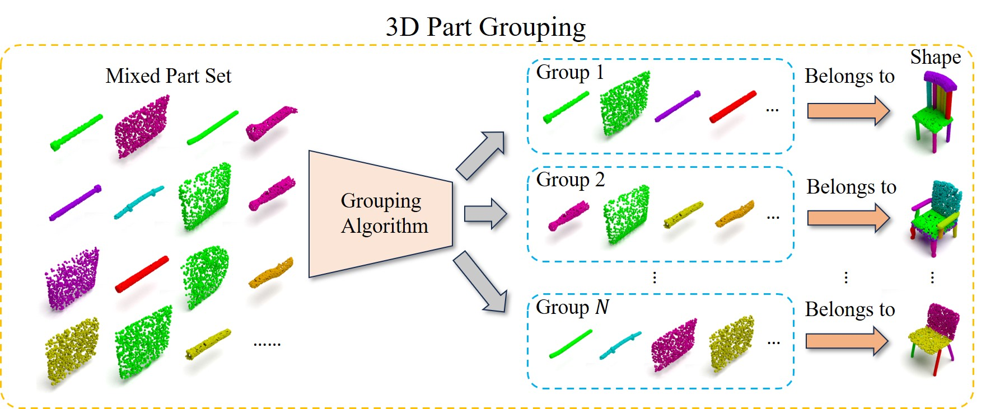

# [CVPR 2024] G-FARS: Gradient-Field-based Auto-Regressive Sampling for 3D Part Grouping

Authors: Junfeng Cheng and Tania Stathaki

## Introduction
In this paper, we propose a new task named '3D Part Grouping'. The image below introduces the definition of our proposed task. Assuming we have a mixed part set containing parts from different 3D shapes, the aim is to use algorithms (which we call grouping algorithms) to group the parts from the same shape together. Please refer to our paper for more details about the task.



## Requirements
- Python 3.8.5
- PyTorch 1.9.1 + CUDA 11.1
- PyTorch Geomtric 2.0.3
- PyTorch3D 0.6.1

## Datasets
We use the shapes from the [PartNet dataset](https://partnet.cs.stanford.edu/) to form our 3D grouping training and testing datasets. In our experiments, we use the [preprocessed dataset](http://download.cs.stanford.edu/orion/genpartass/prepare_data.zip). Please first download this dataset (The original PartNet dataset is not required in our experiments). Then you can use the following commands to obtain the 3D part grouping datasets.

```
bash scripts/create_dataset.sh # Create the training and testing datasets
bash scripts/create_random_dataset.sh # Further process the training dataset
```

## Training
In this paper, we propose G-FARS to solve the task of 3D Part Grouping. Please use the following command to train the G-FARS model:
```
bash scripts/train_gfars.sh
```

## Evaluation
We provide the following script to evaluate the G-FARS algorithm. We also include the pretrained models in the ```pretrain``` folder, so you can use them in the evaluation procedure. 
```
bash scripts/eval_gfars.sh
```

## Rendering
In our code, we use two methods for rendering: PyTorch3D-based and Mitsuba-based. During our validation and evaluation procedures, we employ PyTorch3D-based rendering codes to obtain results, as they are faster. If you want to achieve the rendering effect shown in our paper, please use the Mitsuba-based scripts after completing the evaluation procedure:
```
python render.py
```
Please change the 'PLEASE CHANGE HERE' section in 'render.py' to render the corresponding shapes.

## Citation
If you find our work useful in your research, please consider citing our paper:
```
@inproceedings{cheng2024gfars,
  title = {G-FARS: Gradient-Field-based Auto-Regressive Sampling for 3D Part Grouping},
  author = {Cheng, Junfeng and Stathaki, Tania},
  booktitle = {Computer Vision and Pattern Recognition},
  year = {2024}
}
```

## Acknowledgement
We want to express our gratitude to the following great works:
- [PartNet](https://partnet.cs.stanford.edu/)
- [Generative 3D Part Assembly via Dynamic Graph Learning](https://hyperplane-lab.github.io/Generative-3D-Part-Assembly/)
- [Mistuba](https://www.mitsuba-renderer.org/)
- [PointFlowRenderer](https://github.com/zekunhao1995/PointFlowRenderer)
